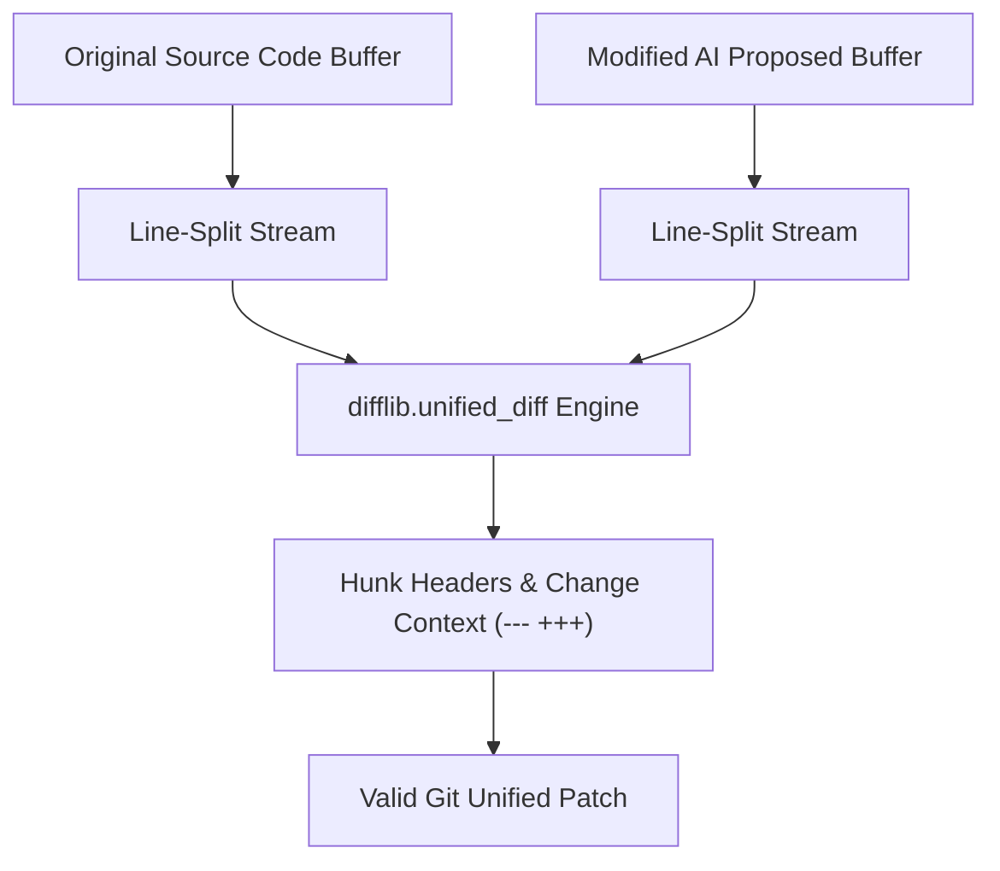

# genpark-automated-code-patch-diff-synthesizer-skill

Agent Skill implementing **Unified Git Diff Patch Synthesis & Code Modification** in 100% Python standard library.

## Architectural Flow

```mermaid
flowchart TD
    Orig["Original Source Code Buffer"] --> Split1["Line-Split Stream"]
    Mod["Modified AI Proposed Buffer"] --> Split2["Line-Split Stream"]
    Split1 & Split2 --> Diff["difflib.unified_diff Engine"]
    Diff --> Hunks["Hunk Headers & Change Context (--- +++)"]
    Hunks --> Output["Valid Git Unified Patch"]
```
